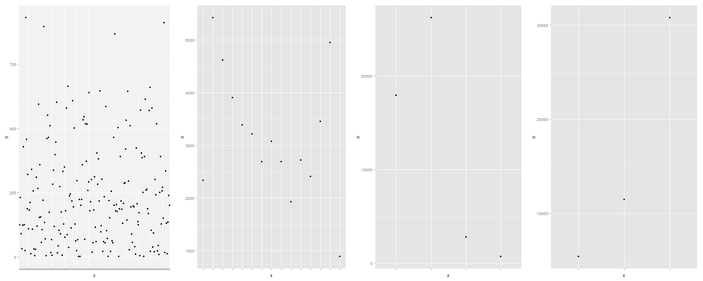
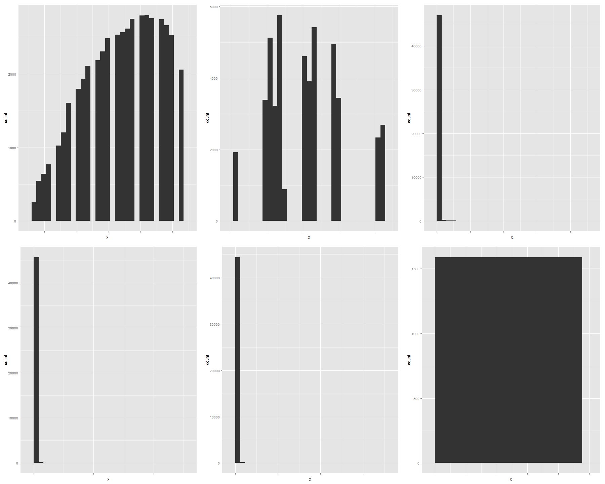

This is the R Markdown file for project 3.

Group members: Travis Cox, Lola Shonaike, and Adam Humphrey

Data source: https://app.enigma.io/search/source/org.un.comtrade

##Summary of data

Our data includes three tables of United Nations commodity trade statistics. The database we pulled our data from contains trade records dating back to 1962. We analyzed data on the trade of aircraft and spacecraft parts, arms and ammunition, and articles of leather. Each file was imported into SQLDeveloper from a CSV file, and then imported into R Studio with the given function on the project requirements page.

###Here is a summary of the data that we are using.
```{r}
source("../01 Data/Project3Data.R", echo = TRUE)
```

##Data Wrangling

We have three sets of data wrangling to show. The first set shows the countries that had the same number of trades in the ammo, aircraft, or leather tables. The second set shows the total number of trades that each country did. The third set shows which countries traded each commodity in the same year.

###Here are the data wrangling sets.
```{r}
source("../02 Data Wrangling/Project3DataWrangling.R", echo = TRUE)
```

##Visualizations

We've made visualizations for each of our data wrangling sets. The first visualization shows each country that had the same number of trades (all categories combined) as another country. The second set of visualizations show the number of trades that each country made for each category of goods. 

```{r}
source("../03 Visualizations/Project3Visualizations.R", echo = TRUE)
```


###categoricals.png


###measures.png

